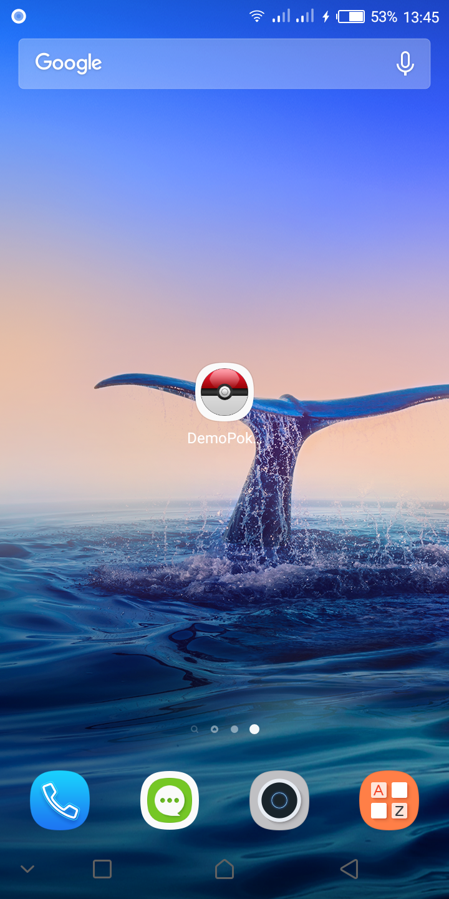
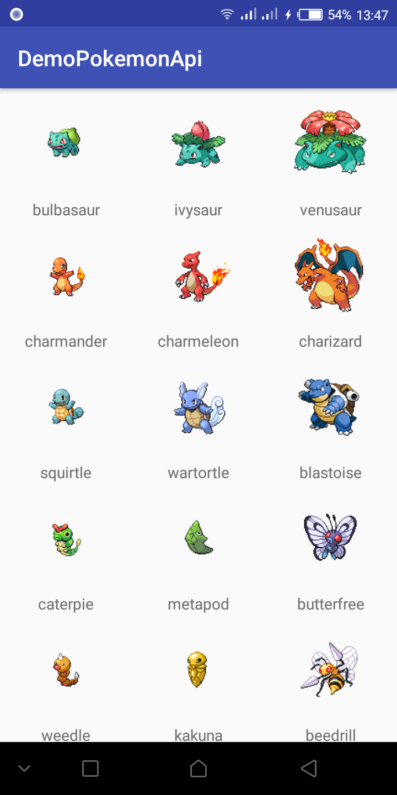
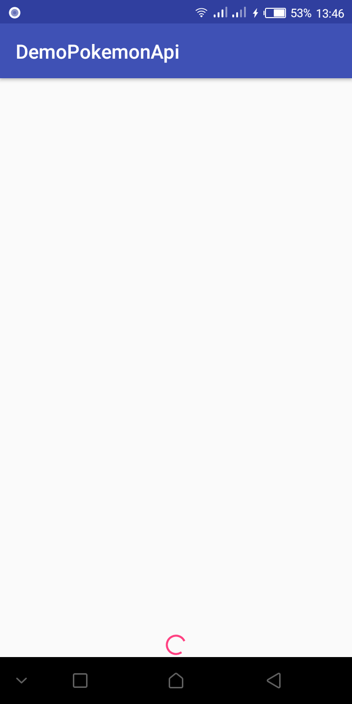
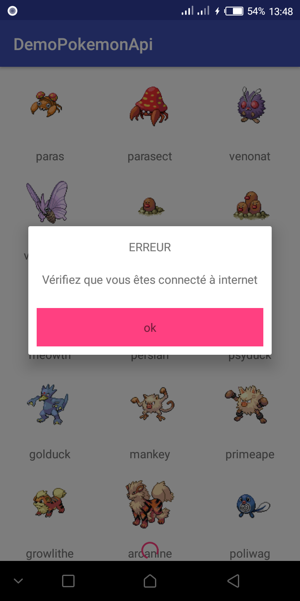
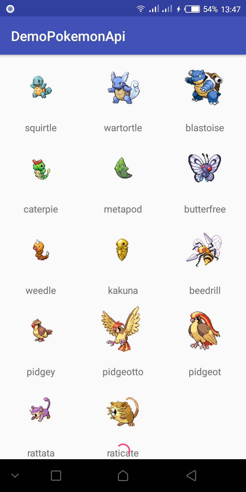

# DemoPokemonApi
pokemon api demo: This demo retrieve a JSON file and a set of
images from the PokeApi backend in order to display the name and the image of each pokemon using the MVP Architecture using
Dagger2, RxJava2, Retrofit2, Gson. 

 

